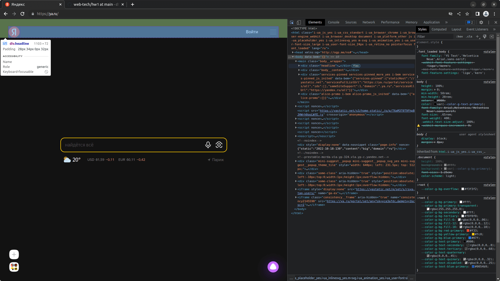

# Знакомство с веб-технологиями, Семинар 1, Домашнее задание

Каталоги и файлы | Описание
-----------------|---------------------------------
`/web-tech/hw1`  | Каталог файлов домашнего задания
`/hw1/images`	 | Каталог скриншотов для решения задачи
`/hw1/README.md` | Условие задачи

## Задача:

На основе сайта  [https://ya.ru :](https://ya.ru)

1. Определите, на каком протоколе работает сайт

2. Проанализируйте структуру страницы сайта

3. Внесите не менее 10 изменений на страницу с помощью инструмента разработчика и представьте скриншоты было/стало

4. Создайте прототип низкой детализации (дополнительное задание, если на семинаре дошли до задания №8)

## Решение:

1. Сайт работает на протоколе HTTPS. Сертификат выдан GlobalSign 19.08.2022 и действителен до 17.02.2023г.

<b>Cкриншот</b>

2. Главная страница сайта содержит:
- заголовок с логотипом компании
- меню сайта
- кнопку авторизации

<b>Cкриншот</b>

Также главная страница содержит:
- Область контента, со строкой поиска
- Виджет погоды с геопозицией посетителя сайта

<b>Cкриншот</b>

Слева, в области контента располагается сервисная панель, а футер на главной странице отсутствует.

<b>Cкриншот</b>

3. Внесены не менее 10 изменений на страницу с помощью инструмента разработчика. Не смог отказать себе в удовольствии создать концептуальный дизайн главной страницы Яндекса.

<b>Cкриншот</b>

